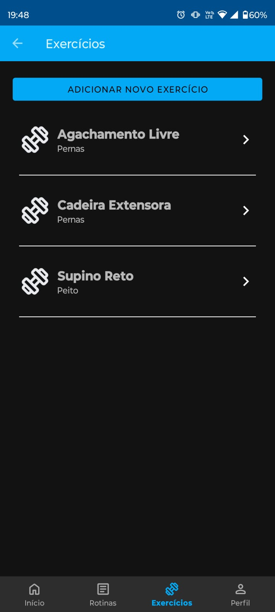
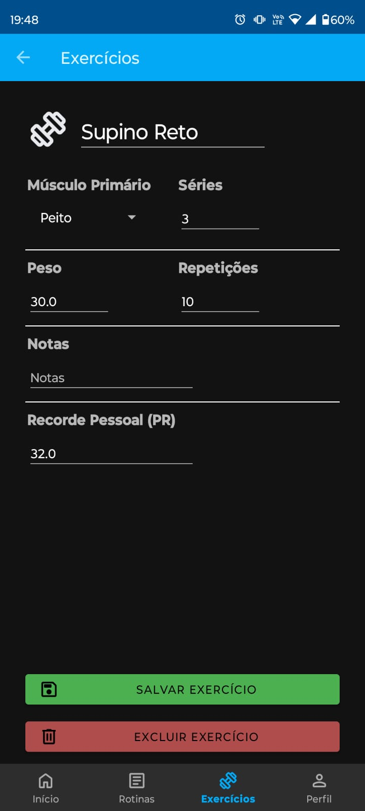
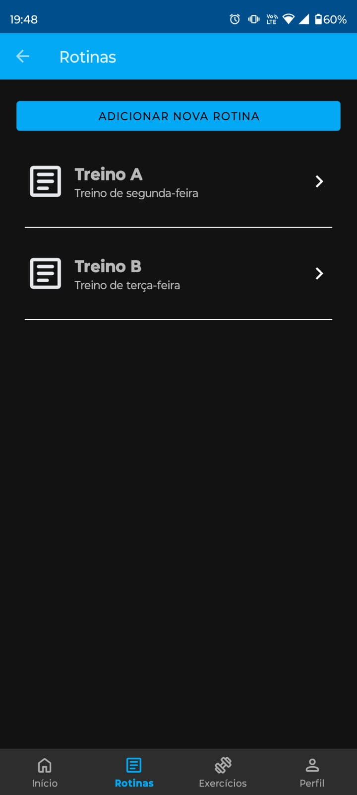
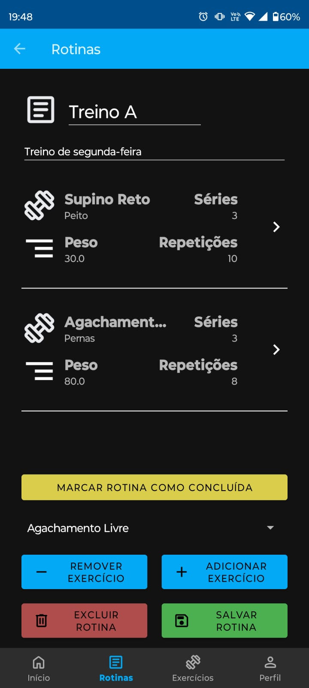
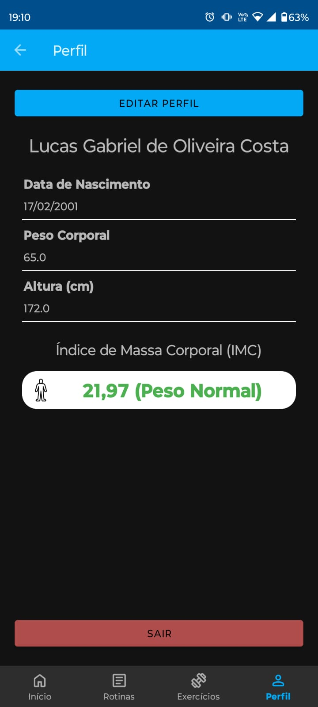
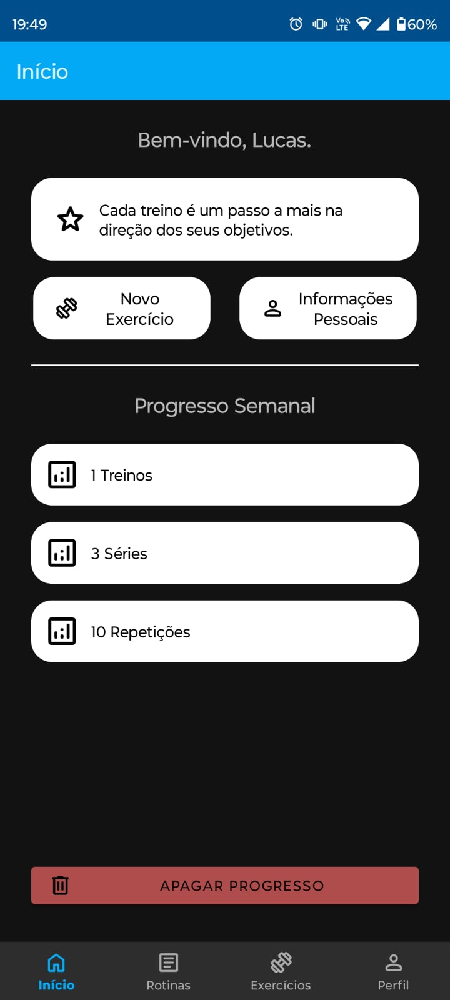
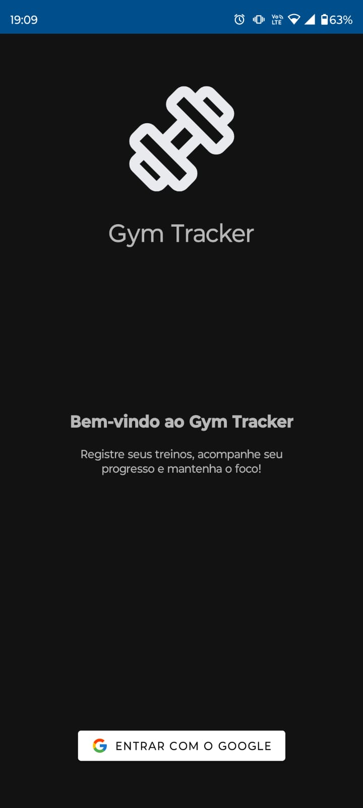

# Gym Tracker 🏋🏽‍♂️📊

Gym Tracker é um aplicativo desenvolvido para ajudar no gerenciamento de treinos, acompanhamento de progresso e motivação ao longo da jornada de treinamento na academia. Ele foi criado como parte do Projeto Final da disciplina de Desenvolvimento para Dispositivos Móveis (2024/2).

## 🚀 Funcionalidades

### 🏋️‍♂️ Adicionar Exercícios
Permite adicionar novos exercícios à rotina de treino, definindo nome, séries, repetições e peso.

  
  

### 📅 Criar Rotinas de Treino
Permite criar rotinas de treino personalizadas, agrupando os exercícios que deseja realizar em um dia específico. Isso facilita o gerenciamento do seu plano de treino.

  
  

### ✅ Marcar Rotinas como Concluídas
Acompanhe seu progresso marcando treinos concluídos. O app mantém um histórico do número de treinos realizados, quantidade de séries e repetições executadas.

### ⚖️ Cálculo do IMC (Índice de Massa Corporal)
Monitore sua saúde física com o cálculo automático do Índice de Massa Corporal (IMC), baseado na sua altura e peso.

  

### 💬 Mensagens Motivacionais
Receba frases motivacionais na tela inicial para se manter motivado a alcançar seus objetivos!

  

### 🔐 Login com Google
Login rápido e seguro utilizando sua conta do Google.

  

## 🔧 Tecnologias Utilizadas
- 📝 **Kotlin** para o desenvolvimento Android.
- 🔥 **Firebase** para autenticação com Google.
- 💾 **SQLite** para armazenamento local de dados.

## 📌 Como Usar
1. Faça login com sua conta do Google.
2. Crie seus treinos, adicionando exercícios e rotinas personalizadas.
3. Atualize os pesos e repetições conforme seu progresso.
4. Marque rotinas como concluídas para acompanhar seu desempenho.
5. Insira seu peso e altura para calcular seu IMC.
6. Toque nas mensagens motivacionais para visualizar novas frases inspiradoras!